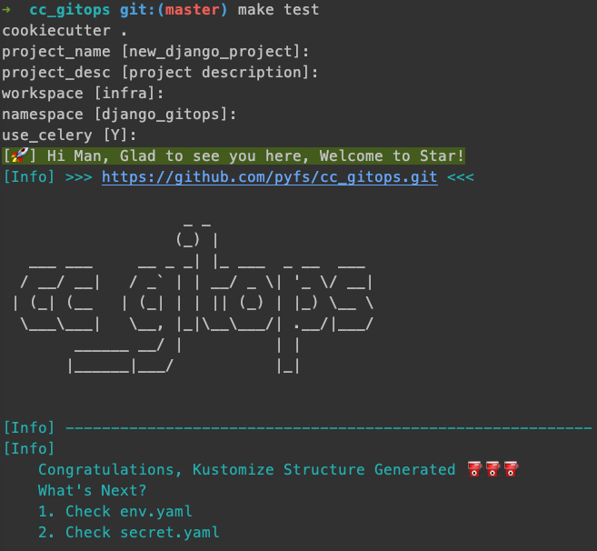

# 简介

通过 cookiecutter 生成 kustomize 配置清单

# 选项说明

```text
# project_name
项目名称, 如需分割, 建议使用中横线, 避免使用下划线

# project_desc
项目描述，用在配置清单说明中

# registry
私有化镜像仓库，以 / 结尾

# workspace
kubesphere 中 "企业空间" 的概念

# namespace
kubernetes 中 "命名空间" 的概念

# use_celery
django 项目启用 celery, 如未启用, 则删除 celery 相关配置清单
```

# 测试

```shell
# 测试
$ make test

# 删除测试数据
$ make clean
```




# 使用在线仓库

```shell
# brew install cookiecutter

$ cookiecutter git@gitlab.gz.cvte.cn:it.Infrastructure/cc_gitops.git
```